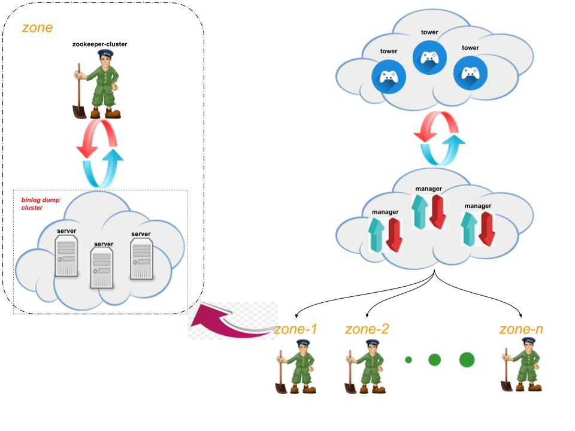

# binlake 

## 最近更新： 

* 欢迎加入技术讨论 咚咚群： 4277846

* 背景  
    使用背景，基于[canal](https://github.com/alibaba/canal), dbsync & filter reg package are referenced from [dbsync](https://github.com/alibaba/canal/tree/master/dbsync) and [filter](https://github.com/alibaba/canal/tree/master/filter)
    目前的使用场景，仅仅能够供当前业务使用，相当于一主多备的情况，对于业务来说，严重浪费资源， 所以需要提供一个公共的平台，供业务方及时消费订阅
    目前支持的binlog解析版本主要支持MySQL， 后续会加入对其他数据库的支持，目前支持的MySQL版本(mysql-5.5.54， mysql-5.7.16， mysql-5.6.34， mysql-5.6.20)
    基于MySQLbinlog 的日志消费订阅业务场景[canal](https://github.com/alibaba/canal) 

* 作用  
    数据库的实时备份 etc, [canal](https://github.com/alibaba/canal) 当中的日志采集功能完全支持

* 提升  
    * 分布式集群任意横向扩展
	* wave服务的无状态
	* 服务之间的互为主备
	* dump 延迟动态均衡
	* 单点服务异常集群内部自由切换

* 项目引用  
    binlog 协议解析采用canal的源码  
    库表过滤规则采用 canal的 AviaterRegexFilter  
    发往MQ的消息格式采用的是canal的protobuf格式代码{因为需要兼容canal, 并且这块canal做了很好的扩展性}  

## 项目介绍：

wave集群： binary log lake， 所有的数据都会往lake当中写入

## wiki文档列表： 

1， HOME  
2， INTRODUCTION  
3， QUICKSTART  
4， DEVELOPER  

### INTRODUCTION

#### 原理： 
MySQL从库复制  

#### 目标：  
中心化元数据，服务集群无状态  

#### 前提：  
MySQL开启binlog，master id必须配置， binlog的格式必须是row模式  

#### 协议：  
MySQL主从复制协议， jdk大小端转换  

#### 软件架构设计：  

#### 部署架构设计: 

#### 服务无状态设计：    
整个集群无状态， 任何一次zookeeper当中监听节点下子节点的变更都会从zk上得到通知，并且开始提供服务且保证，针对任何一台MySQL服务， 有且仅有一台wave服务提供 binlog dump

#### HA：  
zookeeper保证元数据的可用性， 每次更新都会将数据写入到zookeeper当中，保证数据不丢失， 但是如果继续从这个位置开始dump的话，将会出现一定量的数据重复

### QUICKSTART

#### 前提： 
（1）jdk使用1.7以上的版本，因为jdk1.7开启g1的gc算法  

（2）git clone git@git.jd.com:pengan3/binlake.git  
（3）mvn clean install   
（4）cd ./binlake-wave/binlake-wave.server/target  
（5）ls binlake-wave.server-3.0.tar.gz {就是编译之后的整个工程包 直接解压 tar -xvf binlake-wave.server-3.0.tar.gz }  

#### 配置文件说明：  
（1）\# 业务端使用的zk地址：   

zk.servers=127.0.0.1:2181  

（2）\# 消息队列的类型  
mq.type=目前支持kafka 和 JMQ 两种  

... 其余参数请查看config.properties文档

（3）cd binlake-wave.server-1.0/bin && ./start.sh 直接启动即可{启动脚本可能需要修改xmx大小)

